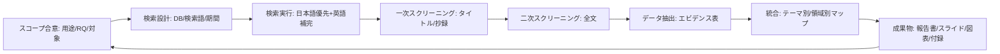

# 調査お願いに対するディープリサーチ提案書

## エグゼクティブサマリー

本件は「調査お願い」というご依頼のみで、テーマ・成果物・意思決定用途が未確定な状態と理解しました。そのため本提案書では、まず**調査の目的（意思決定に何を使うか）を短時間で確定**させた上で、4〜8週間で実行可能な「スコーピング（全体地図化）→ 必要に応じてシステマティック（精査）」の二段構えの調査設計を提示します。スコーピングレビューは、対象領域の文献を体系的に探索して「何が分かっていて、何が空白か」を整理し、次に行うべき精査（システマティックレビュー等）が妥当かを判断するのに適した枠組みです。citeturn3search0turn3search12

成果としては、(a) 調査設計（Research Protocol）と検索ログ、(b) エビデンス一覧（データ表）と重要論文の要約、(c) 図表（PRISMAフロー、エビデンスマップ、概念図）、(d) 報告書・プレゼン、を標準セットとし、意思決定・研究計画・現場実装のいずれにも流用できる形で納品します。システマティックレビューの報告品質を高めるためのPRISMA 2020チェックリストやフロー図テンプレート等を参照し、透明性（再現性）を担保します。citeturn0search8turn0search4

なお、アップロード済み資料には、障害福祉（就労支援）実務の観察に基づく仮説を、査読論文・レビュー・メタ分析で支持/反証するための具体的な調査設計案が含まれており、もし今回の「調査お願い」がこのテーマを指す場合、初期スコープを大幅に短縮できます。fileciteturn0file0

## 想定スコープと前提

「テーマ未確定」案件では、失敗パターンの多くが「情報収集が目的化し、意思決定に繋がらない」ことです。本提案はこれを避けるため、最初に**用途（誰が・いつまでに・何を決めるか）**を固定し、調査の深さ（網羅か、重要論文に絞るか、定量合成まで行うか）を段階的に選べる設計にします。スコーピングレビューが「領域の範囲把握・ギャップ同定」を主目的に持つことは、方法論上も明確です。citeturn3search0turn3search2

また、医療・福祉・精神保健に関わるテーマの場合、制度・定義・分類体系が結論に影響します。例えば診断・分類の一次情報としては、国際標準のentity["organization","世界保健機関","un health agency"]によるICD-11、米国の臨床分類としてはentity["organization","アメリカ精神医学会","psychiatry association us"]のDSM（DSM-5-TR）が代表的です。citeturn1search1turn1search2 ただし、これらは「診療上の分類」であり、研究上はメカニズム横断（トランス診断）やRDoC等の枠組みも併用されます。citeturn4search0turn4search2

日本の制度・統計・運用の一次情報は、まずentity["organization","厚生労働省","japan welfare ministry"]の障害福祉サービス関連ページ群や、障害者雇用状況の公表資料を優先します。citeturn1search0turn2search1 就労・雇用支援に寄せる場合は、entity["organization","独立行政法人 高齢・障害・求職者雇用支援機構","jeed japan"]（JEED）や、福祉・政策情報の集約としてentity["organization","独立行政法人福祉医療機構","wam japan"]（WAM / WAM NET）も一次寄りの参照先になります。citeturn2search0turn2search10

## リサーチクエスチョンと目的

本提案では、まず「一般形」としてのRQ（Research Questions）を置き、次にテーマ確定後に「具体形」へ落とします（最初から具体化し過ぎると、テーマが動いた時に設計が崩れるため）。

**一般形の研究目的（Objectives）**  
- 意思決定に必要な「確からしさの高い事実」「争点（見解の相違）」「未解明（研究ギャップ）」を切り分け、合意形成と次アクションに繋げる。citeturn3search0turn0search8  
- 一次情報（制度・統計・公式定義）と学術エビデンス（査読論文・レビュー）を統合し、現場判断に耐える形へ抄録する（出典追跡可能な形で）。citeturn0search1turn0search8  
- エビデンスの確実性（certainty）を、少なくとも「高/中/低/非常に低」の粒度で示し、推奨の強さを誤解なく伝える（必要時）。citeturn0search22turn0search10  

**一般形のRQ（例）**  
- RQ1: 対象テーマについて、国内一次情報（制度・統計・ガイドライン）は何を示しているか。citeturn1search0turn2search5  
- RQ2: 国際的に、査読済み研究は何を支持し、何を反証し、どこに研究ギャップがあるか（スコーピング）。citeturn3search0turn3search12  
- RQ3: 主要な概念・定義・分類（例：ICD/DSM等）と、研究上のメカニズム理解（例：トランス診断/RDoC）がどこで整合し、どこで不整合か。citeturn4search0turn4search3  
- RQ4: 実務・制度・支援設計へ落とす際の含意（解釈上の注意、外挿可能性、倫理/運用上の制約）は何か。citeturn0search1turn0search22  

**（参考）テーマ候補がアップロード資料の場合の「具体形」**  
アップロード資料は、障害福祉（就労支援）実務における観察仮説を、査読論文・レビュー・メタ分析で支持/反証する構造（困難性メカニズム分類、診断名との不一致、相互作用、医原性、国内固有課題）を既に定義しています。これが今回の対象なら、RQは「領域A〜D」に沿ってそのまま研究質問へ変換できます。fileciteturn0file0  
（この場合、診断分類の限界や異質性を論じる文脈として、DSM診断カテゴリの異質性を指摘する議論（例：診断の異質性、症候群記述の限界）や、RDoCのような研究フレームの位置づけを整理するのが自然です。citeturn4search3turn4search8）

## 方法論

### 情報源の優先順位（日本語優先・一次情報優先）

調査の再現性を担保するため、情報源は「一次→二次→三次」の順に優先し、特に制度・統計・定義は一次情報に固定します（あとから解釈だけ更新できる形にするため）。

- 一次情報（公式・制度・統計）  
  - 障害福祉制度・サービス体系：厚労省の障害福祉サービス等（制度説明、利用、報酬改定、Q&A等）。citeturn1search0turn1search4turn1search16  
  - 障害者雇用の統計・施策：厚労省の障害者雇用対策・雇用状況集計（年次公表）。citeturn2search5turn2search1  
  - 就労・雇用支援実装：JEEDの障害者雇用支援情報（相談窓口・制度運用・調査研究等）。citeturn2search4turn2search8  
  - 福祉・政策情報の集約：WAM / WAM NET。citeturn2search10turn2search18  
  - 国際標準の分類・定義：WHO ICD-11。citeturn1search1turn1search9  
  - 米国臨床分類の公式情報：APA DSM（DSM-5-TR）。citeturn1search2turn1search14  

- 学術論文（日本語優先＋英語補完）  
  - 国内検索：entity["organization","国立情報学研究所","national institute of informatics"]が提供するentity["organization","CiNii Research","japanese academic db"]、および全文基盤としてentity["organization","J-STAGE","japanese e-journal platform"]。citeturn0search3turn0search7turn3search7  
  - 医学系国内：entity["organization","医中誌Web","ichushi database japan"]（必要に応じて機関契約）。citeturn0search11  
  - 国際補完：PubMed等（必要時）。citeturn0search20turn3search12  

- 二次情報（業界レポート・白書等）  
  - 公的機関/研究機関の報告（例：国の審議会資料、研究機関の年報・研究部門の成果）。精神・神経領域の研究拠点としてentity["organization","国立精神・神経医療研究センター","ncnp tokyo japan"]のような一次寄り資源も、テーマによっては参照価値があります。citeturn1search3turn1search11  

### 調査タイプの選択（スコーピング→必要なら精査）

- **スコーピングレビュー**：全体像、主要概念、研究ギャップ、理論枠組み、研究デザイン分布の把握に適します。PRISMA-ScRはスコーピングレビューの報告項目を提供します。citeturn3search0turn3search28  
- **システマティックレビュー（必要時）**：介入効果や因果推論など、結論を強く出す必要がある場合に拡張します。報告透明性はPRISMA 2020を参照します。citeturn0search8turn0search0  

### 検索戦略（Search Strategy）

日本語を主軸にしつつ、概念が英語で進展している領域（例：トランス診断、診断異質性、RDoC等）は英語検索を併用します。citeturn4search2turn4search0  
検索の再現性確保のため、(a) データベース別に検索式、(b) 検索日、(c) ヒット件数、(d) 絞り込み条件、(e) 除外理由（摘要）をログ化します（PRISMA系の考え方と整合）。citeturn0search8turn3search4

**検索語作成の手順（テンプレ）**  
- 日本語：主要概念（制度用語）＋学術概念（例：不一致、異質性、誤診、相互作用、医原性、支援、就労）  
- 英語：同義語展開（heterogeneity, misdiagnosis, transdiagnostic, RDoC, scoping review, etc.）citeturn4search3turn4search2  

（アップロード資料テーマの場合、既にキーワード候補群が整理されているため、それを核に日本語同義語・MeSH相当語を展開します。fileciteturn0file0）

### 選定基準（Inclusion / Exclusion）

テーマ確定前の暫定基準を提示し、Week1で最終化します。

- **含める（Inclusion）**：  
  - 査読論文（原著、システマティックレビュー、メタ分析）を優先。citeturn0search8turn0search1  
  - 日本語文献を優先し、必要に応じて英語を補完。citeturn0search3turn0search7  
  - 公式統計・制度文書（一次情報）。citeturn1search0turn2search1  

- **除外（Exclusion）**：  
  - 研究デザインが不明瞭で検証不能な主張（出典追跡できない二次記事のみ等）。  
  - テーマとの関連が弱い一般論（検索語に引っかかるがRQに答えないもの）。  
  - （必要なら）対象国・対象年・対象集団を逸脱するもの（合意後に確定）。  

### データ収集と分析（Data Collection / Analysis）

- **データ抽出（表形式）**：著者年、対象、デザイン、主要結果、効果/関連、限界、バイアス懸念、実務含意、を統一フォーマットで抽出します。citeturn0search1turn3search12  
- **質評価（必要時）**：確実性の粒度を揃えるため、可能ならGRADE的発想で「確実性（certainty）」を記述します（スコーピングの主目的は質評価ではありませんが、意思決定用途なら最小限の質記述を推奨）。citeturn0search22turn0search10  
- **統合の仕方**：  
  - スコーピングでは、研究領域を「概念×対象×アウトカム×デザイン」のマトリクスで可視化し、ギャップを抽出します。citeturn3search0turn3search2  
  - 争点が出る領域は、立場（診断カテゴリ中心 vs メカニズム横断）を分けて整理します（例：DSM/ICDのカテゴリの異質性問題、トランス診断、RDoC）。citeturn4search3turn4search8turn4search2  

**（図解案）調査プロセスの全体像（Mermaid例）**  

（PRISMA系のフロー図を併用すると、除外理由の透明性が上がります。citeturn0search8turn3search4）

## タイムラインとマイルストーン

下表は8週間を上限に、4週間へ圧縮も可能な設計です（圧縮時は「英文献の深掘り」や「質評価の厳密化」を削り、要点重視に寄せます）。

| 週 | マイルストーン | 主作業 | 想定工数（h） |
|---|---|---|---:|
| Week 1 | スコープ確定 | 用途定義、RQ確定、対象範囲（国/年/集団/アウトカム）合意、プロトコル草案 | 8–12 |
| Week 2 | 検索・取得 | DB別検索式の確定→実行、一次情報（制度/統計）収集、重複除去 | 10–14 |
| Week 3 | スクリーニング | タイトル/抄録→全文の段階選定、除外理由ログ | 12–18 |
| Week 4 | 抽出開始 | 重要論文の深読・データ抽出、一次情報の整理（定義/制度/統計） | 12–18 |
| Week 5 | 中間レビュー | 中間報告（暫定結論・争点・ギャップ）、追加検索（不足領域補完） | 8–12 |
| Week 6 | 統合・構造化 | エビデンスマップ、概念枠組み、含意整理（何が言えて何が言えないか） | 10–14 |
| Week 7 | 成果物ドラフト | 報告書ドラフト、図表整備、付録（検索ログ/抽出表）整形 | 10–16 |
| Week 8 | 納品・合意形成 | 最終版、スライド、発表/QA、次フェーズ提案（研究計画 or 実装） | 6–10 |

**想定総工数（目安）**  
- 4週間（最短）：約40–55h（要点整理＋主要論文中心）  
- 6週間（標準）：約60–85h（スコーピング＋争点整理＋図表）  
- 8週間（拡張）：約80–110h（網羅性向上、質評価の追記、発表/調整込み）

## 成果物

成果物は「再現可能性（検索式・ログ・除外理由・抽出表）」を担保し、利用者が後から更新できる形を基本にします（PRISMA/PRISMA-ScRの思想に整合）。citeturn0search8turn3search0

| 成果物 | 形式 | 内容（例） | 標準/オプション |
|---|---|---|---|
| 調査設計書（Protocol） | PDF/Doc | RQ、範囲、検索DB、検索式、選定基準、抽出項目、分析方針 | 標準 |
| エビデンス表（データ表） | Excel/CSV | 論文メタ情報、要約、限界、確実性メモ、実務含意 | 標準 |
| 検索ログ＋除外理由ログ | Excel/Doc | DB別検索日/式/件数、PRISMA用の記録 | 標準 |
| 報告書（メイン） | PDF | 背景、結果、争点、ギャップ、結論、提言、注意点 | 標準 |
| プレゼン資料 | PPTX | 10–20枚程度：要点、図、意思決定ポイント | 標準 |
| 図表セット | PNG/SVG | PRISMAフロー、エビデンスマップ、概念図、（必要なら）時系列図 | 標準 |
| 日本語要約（現場向け） | PDF/1枚 | 専門用語を抑えた結論・運用ヒント | オプション |
| 追補：追加レビュー案 | PDF | 次にやるべき精査（介入研究、国内比較等）の設計案 | オプション |

**可視化（おすすめ）**  
- PRISMA/PRISMA-ScR準拠の「到達文献フロー」citeturn0search8turn3search4  
- エビデンスマップ（研究領域×研究デザイン×対象集団のヒートマップ）  
- 概念図（例：分類体系・メカニズム・介入ポイントの関係図）  
- （就労支援テーマなら）制度・施策・統計の時系列図（年次公表資料ベース）citeturn2search1turn2search5  

## リスク・前提・未決事項

### 主なリスク

- **スコープ未確定のまま着手**すると、検索が無限に広がり、成果が意思決定に結びつかないリスクがあります（スコーピングレビューが「範囲確定とギャップ同定」に有効である理由でもあります）。citeturn3search0turn3search2  
- 学術論文は「診断カテゴリ」の枠組みで蓄積されがちで、メカニズム横断（トランス診断、RDoC等）と整合しない場合があり、解釈の翻訳が必要になります。citeturn4search3turn4search8  
- 有料DB・購読壁により、全文入手が制約される可能性があります（国内では医中誌Web等に依存する局面があり得ます）。citeturn0search11turn3search7  

### 前提（Assumptions）

- 日本語一次情報（制度・統計・公式資料）を土台にし、英語学術情報で理論・方法論を補完する方針です。citeturn1search0turn0search7  
- まずスコーピングで「論点地図」を作り、必要に応じて次フェーズでシステマティック（介入効果、因果推論等）へ進む二段階設計です。citeturn3search0turn0search8  

### 確認したいオープンクエスチョン（スコープ確定のため）

| 争点 | 選択肢 | なぜ重要か |
|---|---|---|
| 調査テーマ | 具体テーマあり / これから決めたい | 検索語・対象範囲・成果物の粒度が決まる |
| 意思決定用途 | 研究計画 / 現場改善 / 提案書 / 研修教材 / 政策提言 | 「必要な確実性」と「求める表現」が変わる |
| 対象範囲 | 日本中心 / 国際比較 / 特定疾患群 / 横断 | DB選定、包含基準、必要工数が変わる |
| 必要な深さ | 重要論文中心 / 可能な限り網羅 / 定量統合も検討 | 4週で足りるか、8週必要かが決まる |
| 文献アクセス | 無料公開中心 / 機関契約DBを使える / 取り寄せ可 | 全文の入手可能性が結論の強さを左右 |
| Web上の情報取得 | 公開Web・PDF収集を実施してよいか | 一次情報確認と出典提示に影響 |

※本格調査では、公開Web・学術DB・（必要なら）有料DBを横断して文献を取得します。実施の許可（および利用可能な契約DBの有無）をご確認ください。citeturn0search3turn0search11turn1search0

## 予算オプションと次のアクション

### 予算見積もり（概算：税別）

単価は状況により変動するため、ここでは「工数×単価」の透明性を優先した3段階案を提示します（単価は例として **¥8,000 / ¥12,000 / ¥18,000 per hour** を仮置き）。

| プラン | 想定期間 | 工数（h） | 想定単価 | 概算費用 | 含むもの |
|---|---:|---:|---:|---:|---|
| Low | 4週 | 45h | ¥8,000 | ¥360,000 | スコープ確定、主要文献中心のスコーピング、簡易図表、報告書短め |
| Medium | 6週 | 75h | ¥12,000 | ¥900,000 | スコーピングの網羅性向上、争点整理、エビデンス表、図表＋スライド |
| High | 8週 | 105h | ¥18,000 | ¥1,890,000 | 網羅性最大化、質評価の追記、発表/合意形成支援、次フェーズ設計 |

**費用内訳（例：Medium 75hの配分イメージ）**  
- スコープ設計・プロトコル：10h  
- 検索・取得・ログ：15h  
- スクリーニング：15h  
- 抽出（エビデンス表）：15h  
- 統合・図表化：12h  
- 報告書・スライド整形：8h  

※別途費用になり得るもの：有料DB利用料、論文取り寄せ費、翻訳（専門翻訳が必要な場合）、対面開催費など。citeturn0search11turn3search7

### 推奨される次アクション

最短で価値を出す推奨は「Week1のスコープ確定」を先に実施し、その結果で4/6/8週プランを確定することです。スコーピングレビューの思想（まず範囲とギャップを確かめる）にも整合します。citeturn3search0turn3search12

### スコープ確認のために送っていただくメッセージ案（そのままコピペ可）

> 調査を依頼したいです。目的（意思決定用途）は【例：研究計画／就労支援の現場改善／提案書作成】です。対象は【例：日本中心／国際比較も】で、期間は【4〜8週のどれを希望】、優先する成果物は【報告書／スライド／データ表／図表】です。  
> 参考として、調査テーマは【例：アップロード資料の仮説（困難性メカニズムと診断名の不一致）】を想定しています（違えば提案してください）。  
> 公開Web・学術DB・（必要なら）有料DBでの文献収集を実施してよいです。【使える契約DBがあれば名称】も共有します。

（アップロード資料のテーマが今回の対象であれば、その旨だけでも返信いただければ、初週の設計を「領域A〜D」に合わせて即日でプロトコル化できます。fileciteturn0file0）